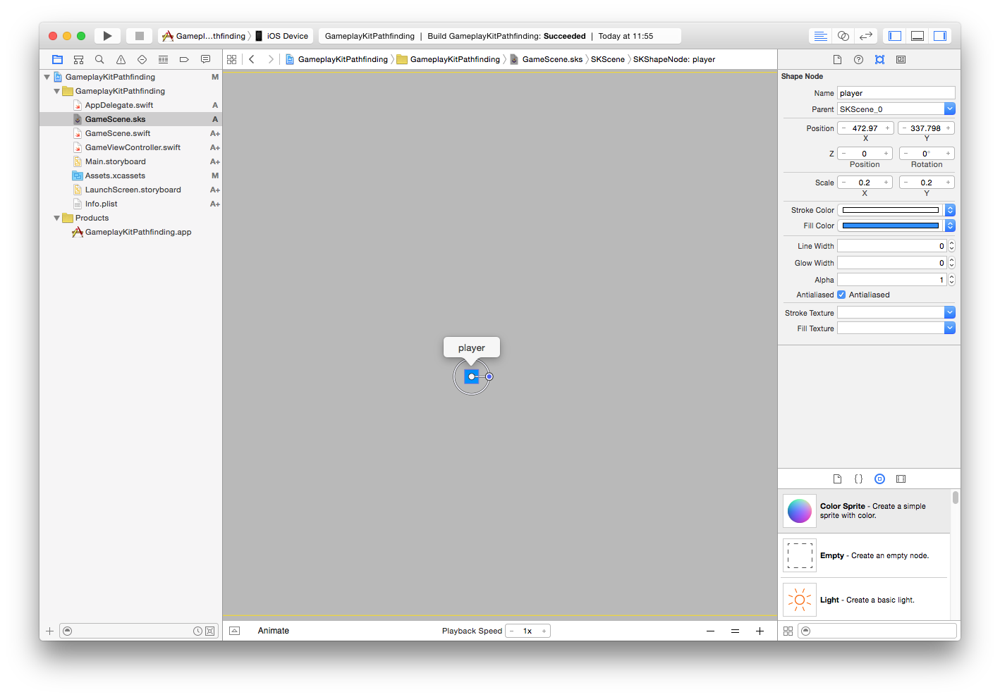
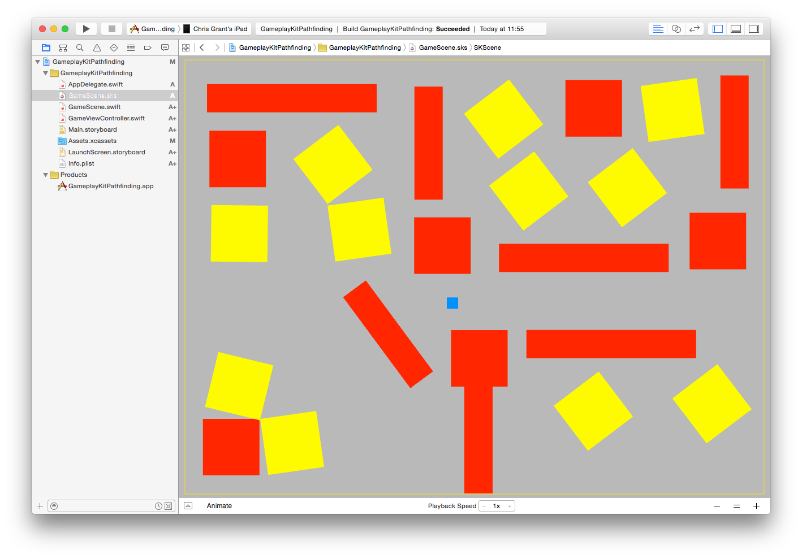

# Day 11 :: GameplayKit - Pathfinding

이전에 배포된 iOS에서 애플(Apple)은 개발자를 위해서 애플 플랫폼 용 게임을 만들기 쉽게 하는 강조점을 많이 추가했었다. iOS 7에서 2D 그래픽과 에니메이션 라이브러리, [스프라이트 킷(SpriteKit)](https://developer.apple.com/library/ios/documentation/GraphicsAnimation/Conceptual/SpriteKit_PG/Introduction/Introduction.html)을 소개 했었다. 그것으로 iOS와 OS X 플렛폼을 위한 인터렉티브 게임을 만들기 위해 사용할 수 있다. [씬킷(SceneKit)](https://developer.apple.com/library/ios/documentation/SceneKit/Reference/SceneKit_Framework/)은 2012년 이후로 맥(Mac)에서 사용 가능했었다. 그러나 WWDC2014에서 그들은 씬킷을 iOS용으로 출시했다. 그리고 파티클 효과와 물리 시뮬레이션과 같은 많은 새로운 기능(feature)을 추가 했다.

과거에 두개를 작업하는데 나는 개인적으로 이 프레임워크가 대단하다고 증언 할 수 있다. 둘다 여러분의 게임의 시각적 요소를 화면에 보여줄 때 정말 도움이 된다. 게임 개발의 아주 약간의 경험을 가지고 있어서, 나는 항상 그것을 사이에서 어떻게 게임을 설계하고 어떻게 엔티티를 모델링 할지 그리고 관계와 상호 작용을 하는 것을 허우적 되는 것 같았다.

iOS 9의 발표에서 애플은 이것을 가지고 개발자를 돕고 시도하는 몇 가지 방법을 제시했다. 그들은 iOS와 OS X에서 게임 개발을 위한 툴과 기술의 모음인 새로운 프레임워크인 GameplayKit을 소개 했다.


> SpriteKit과 SceneKit과 같은 높은-레벨(high-level)의 게임 엔진과 달리 [게임플레이킷(GameplayKit](https://developer.apple.com/library/prerelease/ios/documentation/General/Conceptual/GameplayKit_Guide/)은 에니메이션과 시각적 콘텐트 렌더링이 포함되어 있지 않다. 대신에,  여러분은 GameplayKit을 여러분의 게임플레이 mechanics을 개발하고 최소한의 노력으로 게임 아키텍쳐를 확장 할 수 있는 모듈라(modular)을 디자인 하는데 사용할 수 있다. – Apple “About GameplayKit” Prerelease Docs

새로운 프레임워크는 몇 가지의 기능을 포함한다:

- Randomization
- Entities & Components
- State Machines
- Pathfinding
- Agents, Goals & Behaviors
- Rule Systems

이 포스트는 특히 GameplayKit API 중 새로운 pathfinding 기능으로 보이지만, 나중의 포스트에서 다양한 다른 영역의 일부를 살펴 볼 것이다.

### Pathfinding 예제 만들기

간단한 SpriteKit 예제를 GameplayKit에서 가능한 새로운 pathfinding API의 데모용으로 지금 만들 것이다.

처음으로 Xcode에서 SpriteKit 게임 프로젝트를 셋업한다.


우리가 만들기 원하는 게임을 위한 가장 기본적인 템플릿을 제공한다. 여기까지는 아무런 문제가 없다. 다음 스텝은 `GameScene.sks`을 열고 몇 가지 노드를 추가한다. 처음으로, 플레이가 미로를 통해 이동하는 것을 대변하는 하나의 노드를 추가한다.



Xcode의 오른쪽 방향의 프로퍼티 인스펙트에서 노드의 이름으로 "player"로 설정한다. 이 노드를 접근하기 위해서 이 것을 사용할 것이다.

이제는 플레이가 움직일 때 피할수 있도록 하는 노드를 추가하는 것이 필요하다. 그렇지 않으면 이 길찾기 예제는 매우 간단한 것이다!


Xcode 씬(Scene) 편집이를 사용해서 씬으로 몇 개의 노드를 드레그 한다. 그리고 위의 이미지와 비슷한 것을 확인 할 수 있다. 여러분은 여러분의 미로를 간단하게 또는 더 복잡하게 만들수 있다. 가장 중요한 부분은 쌍의 특정 지점에 길을 만들 때 플레이가 피할수 있도록 하는 적어도 몇 개의 노드가 있어야 한다. 이런 노드에 어떠한 특별한 프로퍼티 설정을 할 필요가 없다. 기본 쉐이프 노드 처럼 그냥 남겨 두면 된다.

다음 스텝은 GameScene.swift 파일을 여는 것이다. 그리고 touchesBegan 메소드를 오버라이드 한다. 경로에 대한 엔드 포인트로 터치가 발생 했을 때 경로로 사용할 것이다.

```swift
// 탭이 감지 될 때 마다, 그 위치에 플레이를 이동한다.
override func touchesBegan(touches: Set<UITouch>, withEvent event: UIEvent?) {
  for touch: AnyObject in touches {
    let location = (touch as! UITouch).locationInNode(self)
    self.movePlayerToLocation(location)
  }
}
```

한 번 플레이의 탭이 감지되면, 플레이 노도의 현재 위치로 부터 탭을 한 곳 까지 그 길을 따라 어떠한 장애물을 피할 경로를 만들 수 있다. 이를 위해서 movePlayerToLocation 라는 새로운 함수를 만들 것이다.

```swift
/// 플레이서 스프라이트를 씬을 통해서 가는 길에 장애물은 피하면서 주어진 포인트로 이동하기.
func movePlayerToLocation(location: CGPoint) {
  // 이미 움직이고 있을 때 플레이어는 움직일수 없는 것을 확인한다.
  guard (!moving) else {return}
  moving = true
```

첫 스탭은 플레이어를 얻는 것이다. 이와 같은 작업을 이전에 씬 에디터에서 플레이어 노드에 이름을 지어놓은 무언가를 전달하는 childNodeWithName 함수를 통해서 할 수 있다.

```swift
// 씬에서 플레이어 찾기
let player = self.childNodeWithName(“player")
```

플레이어를 가지면, 씬에서 다른 모든 노드를 포함하는 어레이를 셋업해야 한다. 이것은 플레이어 노드가 궁극적으로 장애물을 피할 수 있게 해준다.

```swift
// 플레이어 노드로 부터 떨어진 모든 자식 노드를 가진 장애물 에레이 만들기.
let obstacles = SKNode.obstaclesFromNodeBounds(self.children.filter({ (element ) -> Bool in
  return element != player
  }))
```

장애물이 있으면, 이제 플레이어의 현재 위치로 부터 이 함수로 전댈된 위치까지의 경로를 이것을 사용하여 계산할 수 있다.

```swift
// 장애물로 기초하여 그래프를 만든다. 반지름에 약간의 버퍼 공간을 만들어서 플레이어 노드의 중심과 장애물의 가장자리 사이의 약간의 공간이 있다.
let graph = GKObstacleGraph(obstacles: obstacles, bufferRadius: 10)
사용자의 현재 위치를 위한 노드를 만든다. 그리고 마지막 위치를 위한 것도 만든다.
let startNode = GKGraphNode2D(point: float2(Float(player!.position.x),
Float(player!.position.y)))
let endNode = GKGraphNode2D(point: float2(Float(location.x),
Float(location.y)))
//방금전 만든 두개의 노드를 그래프로 연결 한다.
graph.connectNodeUsingObstacles(startNode)
graph.connectNodeUsingObstacles(endNode)
// 시작 노드부터 끝 노드까지 그래프를 사용해서 경로를 찾는다.
let path:[GKGraphNode] = graph.findPathFromNode(startNode, toNode: endNode)
// 만약 경로가 0개 노드를 가지면 경로를 찾을 수 없다. 그래서 return 한다.
guard path.count > 0 else { moving = false; return }
```

가는 길에 장애물을 피해서 경로가 만들어 졌으니 플레이어 노드는 경로를 따라서 갈수 있다. SKAction.followPath(path: CGPath, speed: CGFloat)를 사용해서 액션을 만드는게 가능하다. 그러나 이 경우에는 구별되는 단계로 각 단계의 경로를 보여주는 것을 선택했다. 그래서 pathfinding 알로리즘의 결과는 더 명백하다. 하지만 실제 게임에서는 아마도 SKAction.followPath를 사용하길 원할 것이다. 

다음의 코드는 경로에서 각 갭의 moveTo SKAction을 만든다. 그리고 순차적으로 그것을 조립하고 플레이어 노드의 동작을 수행한다.

```swift
// 플레이어 노드가 이동할 경로로 사용할 수 있는 액션의 어레이를 생성한다.
var actions = [SKAction]()
for node:GKGraphNode in path {
  if let point2d = node as? GKGraphNode2D {
    let point = CGPoint(x: CGFloat(point2d.position.x), y: CGFloat(point2d.position.y))
    let action = SKAction.moveTo(point, duration: 1.0)
    actions.append(action)
  }
}
// 이런 액션을 시퀀시 액션으로 변환한다. 그리고 플레이어 노드에 이것을 실행한다.
let sequence = SKAction.sequence(actions)
player?.runAction(sequence, completion: { () -> Void in
// 액션이 완료 되었을 때, 플레이어를 다시 움직일수 있게 한다.
  self.moving = false
})
}
```

이제, 씬의 어디든 탭을 하면, 플레이어 노드는 그 지점으로 씬의 모든 다른 노드를 피하면서 이동을 할 것이다! 만약 노드의 가운데를 탭하거나 플레이어 노드가 움직일수 없는 곳을 탭하면 더 이상 플레이어 도느는 움직이지 않는다.

### The Result
아래의 비디오는 결과를 보여준다. 플레이어가 장애물 주변로 이동을 하고 현재의 위치에서 씬의 반대편으로 길을 만드는 방법을 확인할 수 있다.

[비디오 파일](./images/PathfindingComplete.mov)

이것은 새로운 pathfinding 기능의 매우 간략한 개요이다. GameplayKit의 나머지 기능으로 통합하는 방법을 배우는 것은 게임 개발을 할 때 열쇠이다. 그리고 그것은 잠재적으로 추후 포스트에서 다룰 내용이다.

### Further Reading
이 포스트에서 다루었던 새로운 GameplayKit 기능에 더 많은 정보를 위해서 WWDC session 608, [Introducing GameplayKit](https://developer.apple.com/videos/wwdc/2015/?id=608)을 살펴봐라. 잊지 마라라, 만약에 이 포스트에서 만들고 설명했던 프로젝트를 한 번 시도 해보기 원하면, [github](https://github.com/shinobicontrols/iOS9-day-by-day/tree/master/11-GameplayKit-Pathfinding)를 통해서 찾을 수 있다.

만약 질문이나, 코멘트가 있다면 여러분의 피트백을 듣기를 원한다. [@christhegrant](http://twitter.com/christhegrant) 로 트윗을 보내거나, [@shinobicontrols](http://twitter.com/shinobicontrols) 를 팔로우해서 iOS9 Day-by-Day 시리즈의 최신의 뉴스나 업데이트 소식을 얻을 수 있다.
